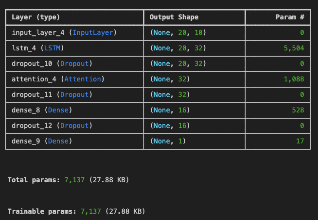
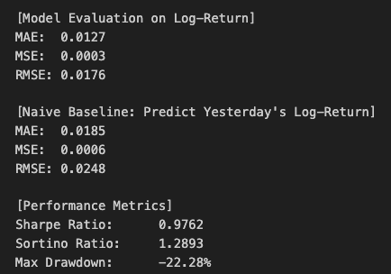
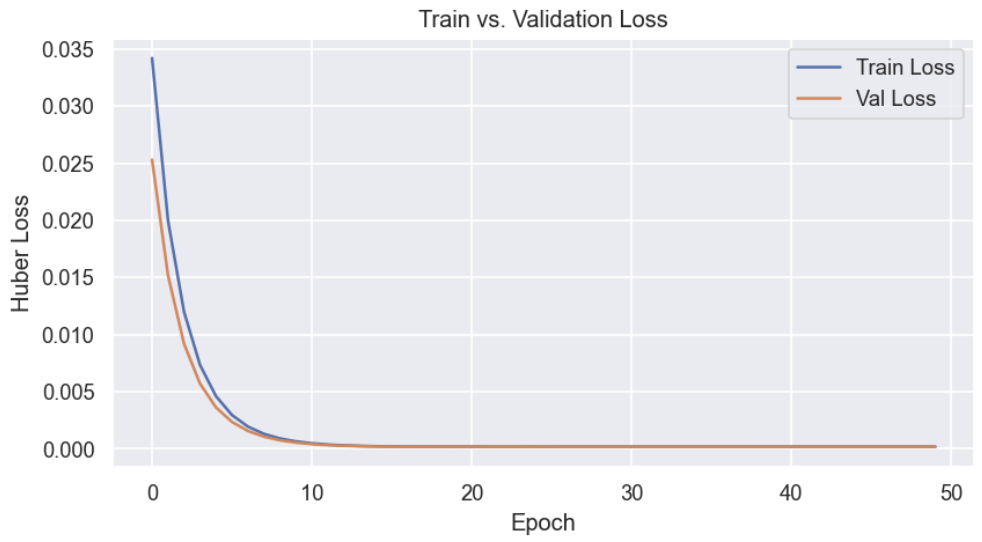

# 📈 LSTM + Attention for Log-Return Forecasting

This project builds a **deep learning model** with **LSTM and a custom Attention mechanism** to predict daily **log-returns** of stock prices. It outperforms a naive benchmark, avoids overfitting, and demonstrates solid **risk-adjusted performance** in a noisy financial environment.

📄 [Click here to read the full LSTM + Attention Report (PDF)](./LSTM%20Attention.pdf)

# About

Developed an LSTM-based model combined with an Attention mechanism to predict daily stock log-returns. The model uses Huber Loss as the loss function, along with techniques such as Dropout, L2 regularization, EarlyStopping, and dynamic learning rate adjustment to prevent overfitting. On the test set, it outperforms the Naive Baseline with a 31% reduction in MAE and a 29% reduction in RMSE. The Sharpe Ratio reaches 0.9762, and the Sortino Ratio is 1.2893, indicating strong risk-adjusted performance. Training and validation losses converge closely, showing no signs of overfitting. The model architecture is lightweight, with only around 7,100 parameters in total.
---

## 🧠 Model Architecture

---

## 🧪 Model Evaluation on Log-Return

| Metric      | LSTM + Attention | Naive Baseline *(Previous Day’s Return)* |
|-------------|------------------|-------------------------------------------|
| MAE         | **0.0127**       | 0.0185                                    |
| MSE         | **0.0003**       | 0.0006                                    |
| RMSE        | **0.0176**       | 0.0248                                    |

> ✅ **Performance improvement over naive baseline**  
> MAE improved by **+31.4%**, RMSE improved by **+29.0%**

---

## 📉 Risk-Adjusted Performance

| Metric         | Value    |
|----------------|----------|
| **Sharpe Ratio**  | 0.9762   |
| **Sortino Ratio** | 1.2893   |
| **Max Drawdown**  | -22.28%  |

> These risk metrics suggest the model offers **reasonable returns per unit of risk**, especially in high-volatility scenarios.

---

## 🔍 Loss Curve – No Overfitting

> Validation loss closely tracks training loss with no divergence, indicating **good generalization and no overfitting**.

---

## 💾 Model Details

- Loss Function: Huber Loss (robust to outliers)
- Regularization: L2 + Dropout + EarlyStopping
- Optimizer: Adam with LR scheduling
- Data: 20-day time windows, 10 log-return based features
- Output: Next-day log-return prediction

---

## 🧠 Conclusion

This LSTM + Attention model is a **robust baseline** for financial time-series forecasting. It:
- Beats the naive baseline on all metrics
- Demonstrates solid risk-adjusted returns
- Shows **no signs of overfitting**
- Is ideal for further development into **position sizing** or **trading signal generation**

